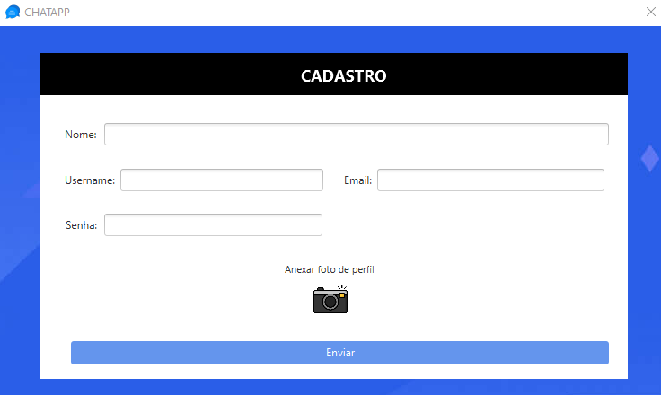

# Chat-App

### Sobre o Projeto
Este chat desenvolvido com JavaFX e utilizando os conceitos de Cliente-Servidor (ServerSocket e Socket).

Ferramentas utilizadas:
* Eclipse
* MySQL
* SceneBuilder

### Como executar o .jar:

```
java --module-path "CAMINHO DA PASTA DO JAVAFX/lib" --add-modules javafx.controls,javafx.fxml,javafx.swing -jar LOCAL_DO_JAR/chat-app.jar
```

<br/>

### Screenshots:
 <br> <br>
 <br> <br>
 <br> <br>
